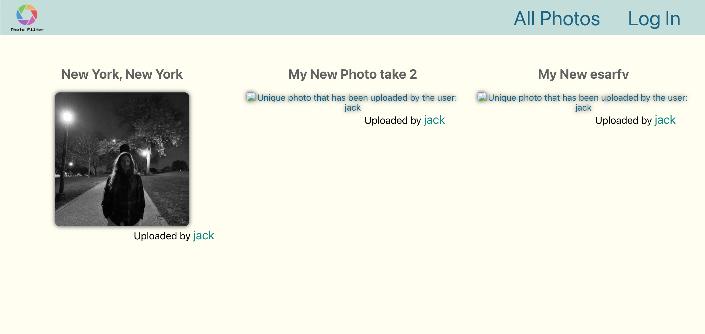
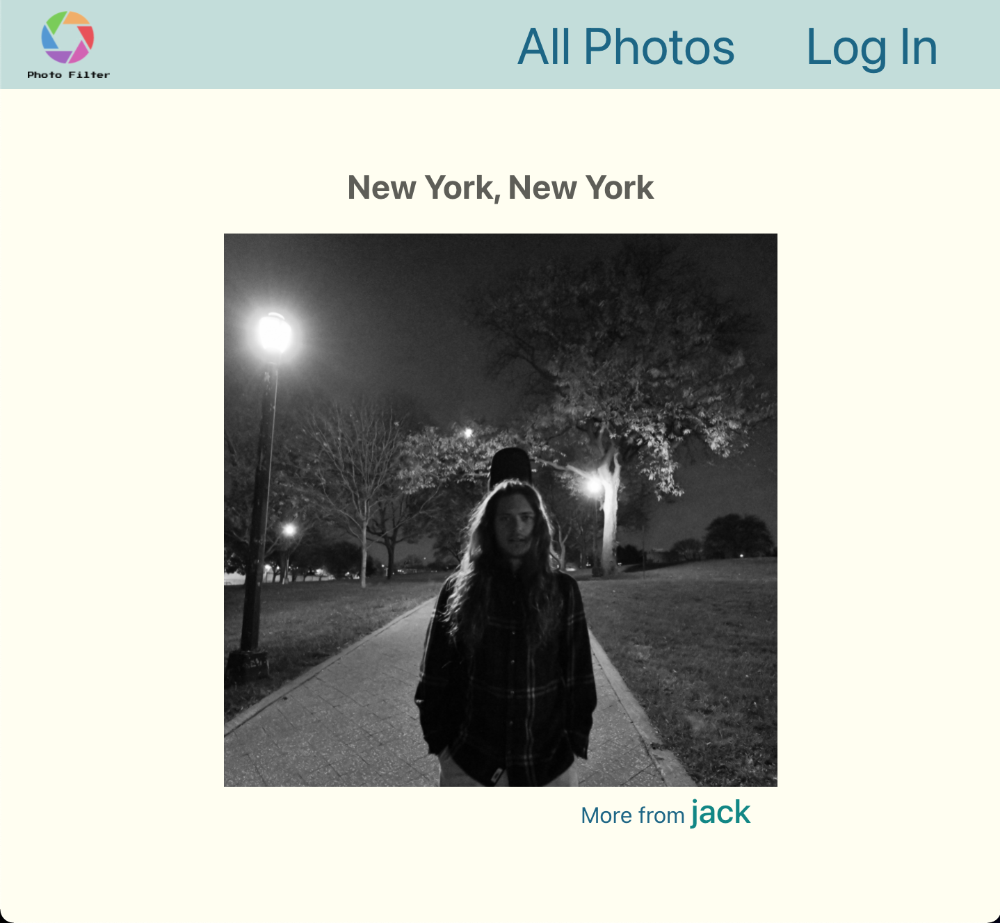
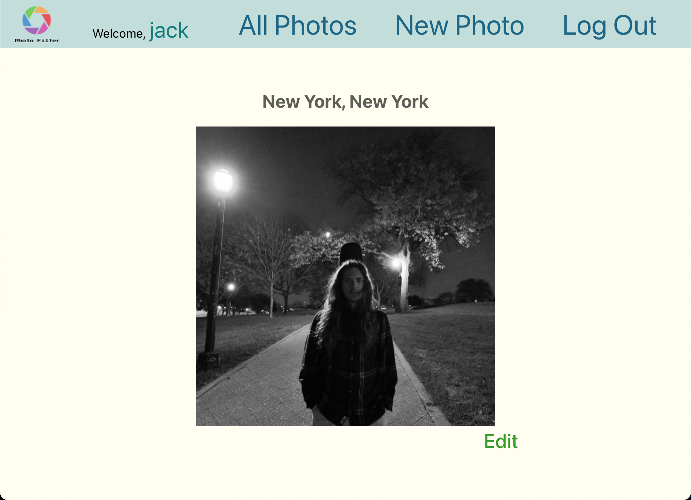
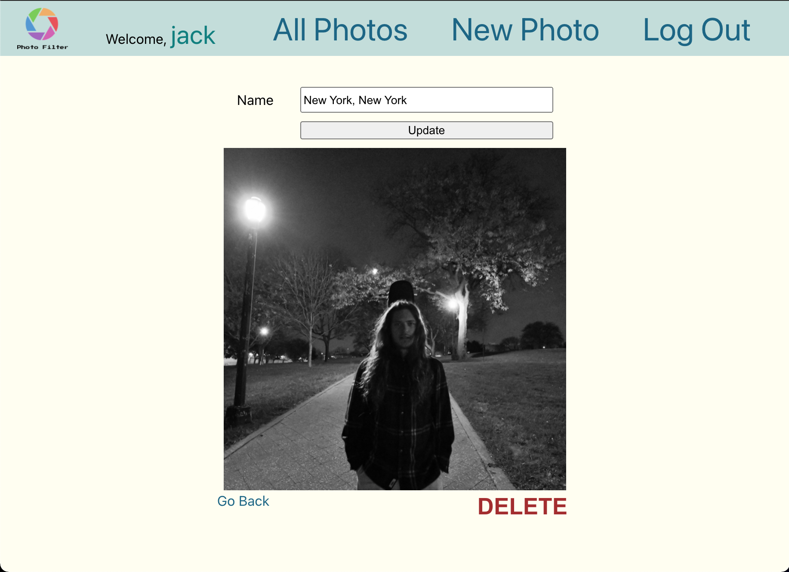

# Photo Filter

Welcome to Photo Filter, where one day you will be able to edit your own photos right up on the web!

# Screenshots

# Technologies Used

1. HTML
2. CSS
3. Javascript
4. Mongoose
5. Express
6. Node.js
7. MongoDB
8. React

# Getting Started

So, are you ready to upload a [Photo](https://photos-filtered.herokuapp.com/)?
If you'd like even more context, visit my [trello board](https://trello.com/b/qlb0VjWO/photo-filter).

# next steps

## Icebox Items:
1. AAU I want to be able to add filters to my photos after I upload them
2. AAU I want to be able to choose whther or not my photos can be viewed publicly.
3. AAU I want to be able to see all the final edits I've made of all of my original photos.
4. AAV I want to be able to see a user's page.